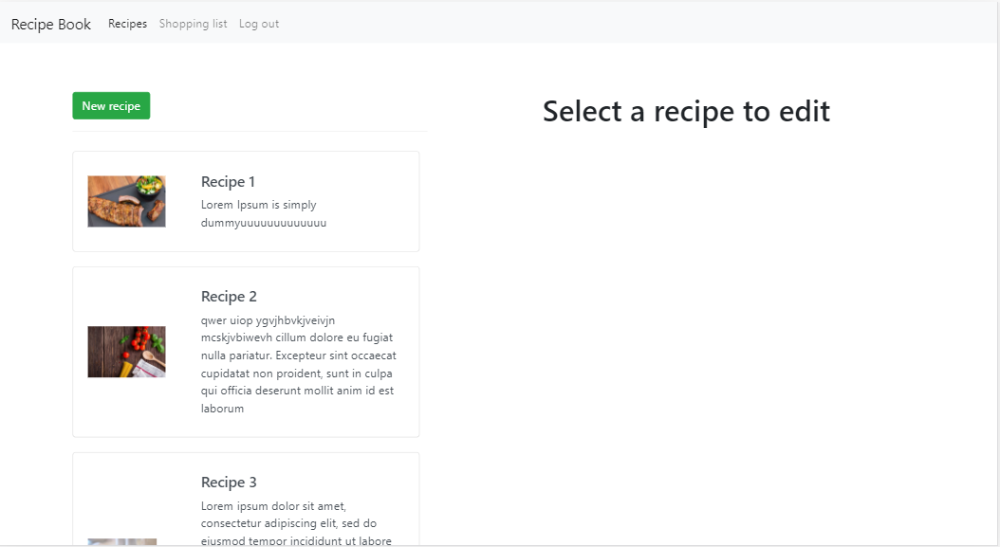
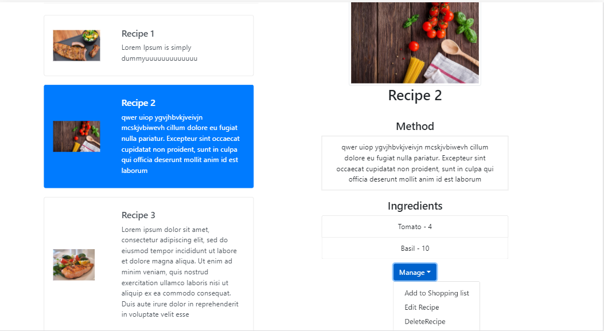
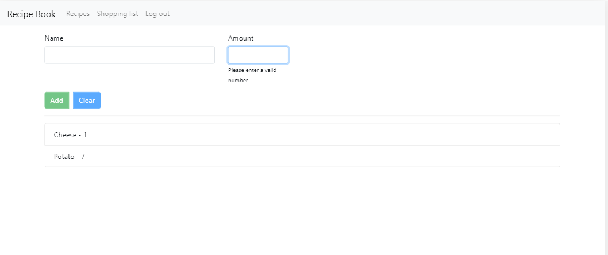
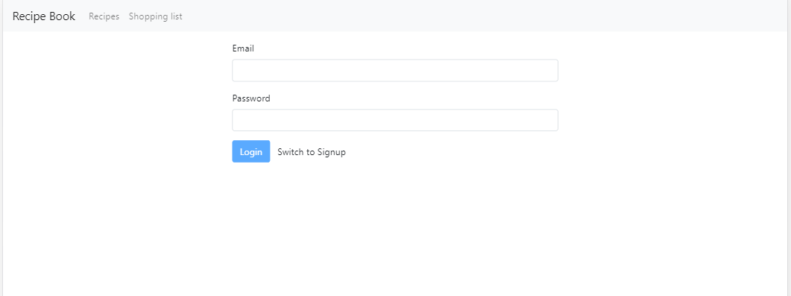

## Project description
This project displays a list of recipes, with a picture, method and ingredients used and allows the user to edit a recipe, save the information and also to create a shopping list.
It is built using Angular 9 framework and makes use of angular routing, feature modules, lazy loading, template driven and reactive forms. Firebase is used for hosting, authentication and database.

## Avg time duration
1.5 months

## Preview
https://recipes-project-b2ca6.web.app/

## Snapshots

### Main page

### Display Single Recipe

### Shopping list page

### Login page

